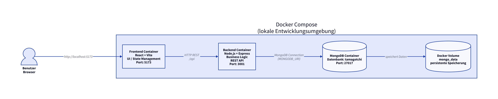
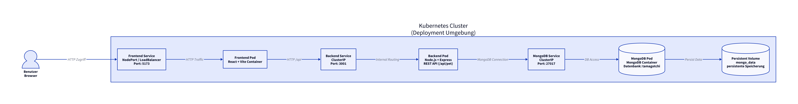

# Docker Compose Architektur

## Übersicht

Die Anwendung besteht aus drei Hauptkomponenten:

- Frontend (React + Vite)
- Backend (Node.js + Express REST API)
- MongoDB Datenbank

Die Komponenten laufen lokal in separaten Docker Containern und kommunizieren über ein internes Docker Netzwerk.

## Architekturdiagramm

## Kommunikation

- Browser → Frontend
- Frontend → Backend REST API
- Backend → MongoDB
- MongoDB → persistentes Docker Volume

# Kubernetes Architektur

## Übersicht

Die Anwendung wird in einer Kubernetes Umgebung betrieben.  
Die einzelnen Komponenten laufen in separaten Pods und kommunizieren über Kubernetes Services innerhalb des Clusters.

Die Architektur besteht aus folgenden Komponenten:

- Frontend Pod (React + Vite)
- Backend Pod (Node.js + Express REST API)
- MongoDB Pod
- Kubernetes Services für die interne und externe Kommunikation
- Persistentes Volume zur dauerhaften Speicherung der Datenbankdaten

---

## Architekturdiagramm

---

## Kommunikation

- Der Benutzer greift über einen Frontend Service auf die Anwendung zu
- Der Frontend Pod verarbeitet die Benutzeroberfläche
- Das Frontend kommuniziert über REST API Requests mit dem Backend Service
- Der Backend Pod verarbeitet die Business Logic
- Das Backend kommuniziert mit MongoDB innerhalb des Kubernetes Clusters
- MongoDB speichert die Daten persistent über ein Kubernetes Volume

---

## Kubernetes Komponenten

### Frontend Service
Der Frontend Service stellt den Zugriff auf die Webanwendung bereit.  
Je nach Umgebung kann dafür ein NodePort oder LoadBalancer verwendet werden.

### Backend Service
Der Backend Service ermöglicht die interne Kommunikation zwischen Frontend und Backend innerhalb des Clusters.

### MongoDB Service
Der MongoDB Service stellt die Verbindung zur Datenbank innerhalb des Clusters bereit.

### Persistentes Volume
Das persistente Volume sorgt dafür, dass die Datenbankdaten auch nach einem Neustart der Container erhalten bleiben.

---

## Ziel der Kubernetes Architektur

Die Kubernetes Umgebung ermöglicht:

- bessere Skalierbarkeit
- getrennte Services und Deployments
- containerisierte Bereitstellung
- einfachere Wartung und Erweiterbarkeit
- stabile Kommunikation zwischen den Komponenten